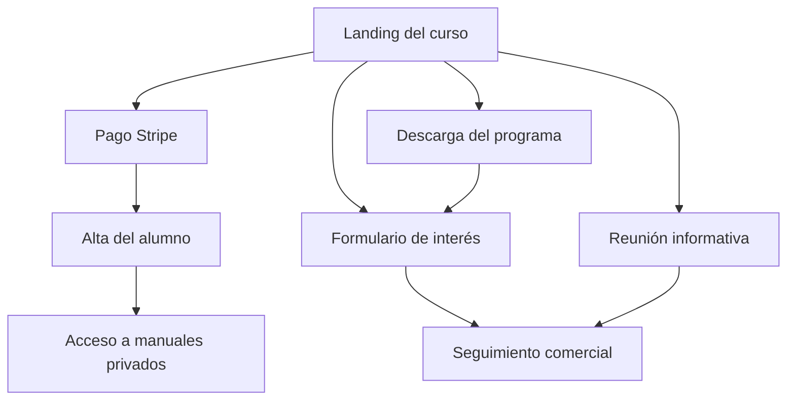

# Product specification

## Producto

**Nombre:** Programa personalizado de Gestión Laboral Integral  
**Marca:** EXPERT Business Academy  
**Slug:** `gestion-laboral-integral`  
**Idioma inicial:** español  
**Idioma disponible:** ruso bajo personalización  
**Precio:** 1.200 €  
**Formato:** online e individual  
**Carga lectiva:** 20 horas  
**Acompañamiento incluido:** 5 horas

## Problema que resuelve

Muchas pymes dependen de terceros para cualquier movimiento laboral porque carecen de un proceso interno que conecte normativa, convenio, nóminas, Seguridad Social, contratación, archivo y contabilidad. El curso convierte esa operativa fragmentada en un sistema reproducible.

## Usuario principal

- gerente o administrador de pyme;
- responsable de administración;
- persona de RR. HH. no especialista;
- empresa con plantilla pequeña o mediana;
- usuario de Holded que quiere incorporar la gestión laboral;
- empresa que utiliza Sistema RED / SILTRA y herramientas de contratación.

## Resultado prometido

Capacidad para ejecutar y controlar la gestión laboral ordinaria con procedimientos documentados, sabiendo identificar cuándo es necesario escalar a un profesional.

## Alcance formativo

1. Fundamentos de gestión laboral.
2. Convenio colectivo.
3. Conceptos retributivos y tablas salariales.
4. Configuración laboral en Holded.
5. Contratación y afiliación.
6. Nómina mensual.
7. Cotización y SILTRA.
8. Variaciones, bajas y finiquitos.
9. Cierre laboral y fiscal.

## Incluido

- 20 horas individuales;
- 5 horas de tutoría;
- manuales y checklists;
- casos prácticos;
- acompañamiento en un cierre;
- acceso a actualizaciones de los materiales vinculados al programa.

## Fuera de alcance

- representación en litigios;
- despidos complejos o colectivos;
- inspecciones;
- sanciones disciplinarias complejas;
- negociación colectiva;
- ejecución por EXPERT de la gestión mensual del cliente;
- PRL, Delt@, mutua o control horario cuando estén contratados con terceros.

## Embudo

## KPIs

- conversión visita a CTA;
- clics en pago;
- leads enviados;
- entrevistas reservadas;
- descargas del programa;
- ratio lead a pago;
- ratio entrevista a pago;
- alumnos que acceden a la documentación;
- finalización de módulos y tutorías.

## Criterios de aceptación

- Toda información comercial coincide con el dossier aprobado.
- Los tres CTAs principales funcionan.
- El PDF se descarga con nombre correcto.
- El programa aparece en sitemap y metadata.
- La base laboral permite navegación por módulo.
- El contenido privado exige sesión y matrícula.
- No aparecen datos personales de Ilya ni de trabajadores.

